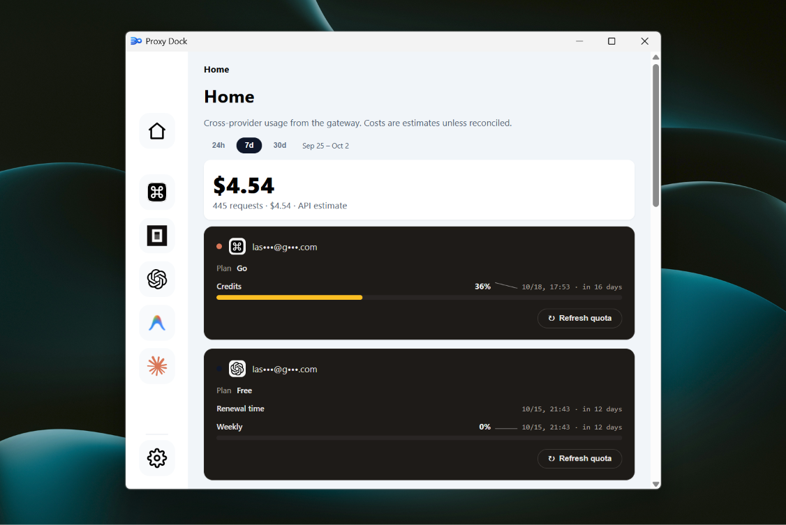

<p align="center">
  
</p>

# Proxy Dock

Proxy Dock puts your AI subscriptions (ChatGPT, OpenCode, Command Code, Antigravity, Claude) behind one local OpenAI-compatible endpoint, with usage, cost, and quota in one dashboard.



## Install

Download installers from [Releases](https://github.com/catcaptions/proxy-dock/releases). Latest is [v0.1.0](https://github.com/catcaptions/proxy-dock/releases/tag/v0.1.0) with the Windows x64 installer ([`Proxy.Dock_0.1.0_x64-setup.exe`](https://github.com/catcaptions/proxy-dock/releases/download/v0.1.0/Proxy.Dock_0.1.0_x64-setup.exe)). macOS / Linux have no published builds yet — build from source below.

All builds are unsigned: Windows SmartScreen will warn, macOS Gatekeeper needs right-click → Open on first launch. Signing is planned.

Or build from source — prerequisites everywhere: [Node](https://nodejs.org) 20+, [Rust](https://rustup.rs) stable, and `npm install` in the repo. Then pick your OS.

### Windows

Install NSIS 3 (`winget install NSIS.NSIS`) plus the [VS Build Tools](https://visualstudio.microsoft.com/visual-cpp-build-tools/) (Desktop C++ workload), then:

```sh
npm run build
npx tauri build --bundles nsis
```

Installer lands at `src-tauri/target/release/bundle/nsis/Proxy Dock_0.1.0_x64-setup.exe`.

### macOS

Install the Xcode Command Line Tools (`xcode-select --install`), then:

```sh
npm run build
npx tauri build --bundles dmg
```

The `.dmg` lands at `src-tauri/target/release/bundle/dmg/`.

### Linux

Install the Tauri system deps first ([full list](https://v2.tauri.app/start/prerequisites/)). Debian/Ubuntu:

```sh
sudo apt install libwebkit2gtk-4.1-dev build-essential curl wget file libssl-dev libayatana-appindicator3-dev librsvg2-dev
```

Fedora:

```sh
sudo dnf install webkit2gtk4.1-devel openssl-devel curl wget file libappindicator-gtk3-devel librsvg2-devel
```

Arch:

```sh
sudo pacman -S webkit2gtk-4.1 base-devel curl wget file openssl appmenu-gtk-module gtk3 libappindicator-gtk3 librsvg
```

Then:

```sh
npm run build
npx tauri build --bundles appimage   # single portable file, no install
npx tauri build --bundles deb         # .deb for Debian/Ubuntu
```

Linux builds are not yet verified on our machines — report what breaks.

## Use

1. Launch the app and sign in on each provider page. Each provider uses its own official flow (browser OAuth for ChatGPT/Codex, issued key for OpenCode Go, CLI login for Command Code Go, Google OAuth for Antigravity, OAuth or `sk-ant-` key for Claude). Keys stay in the OS credential store, never in the database.
2. Point any OpenAI-compatible client at the gateway:

```text
http://127.0.0.1:11434/v1                 unified (model: <provider>/<native-id>)
http://127.0.0.1:11434/commandcode/v1     provider paths take native ids
http://127.0.0.1:11434/opencode/v1
http://127.0.0.1:11434/chatgpt/v1
```

Examples: `commandcode/z-ai/glm-5.3-flash`, `chatgpt/gpt-6-luna` on `/v1`; `gpt-6-luna` on `/chatgpt/v1`.

3. Send `Authorization: Bearer <key>` on every call. Fresh installs use `proxy-dock`. Copy or rotate it in Settings. Only `/health` is open without a key.

One provider can have multiple accounts; the gateway rolls across them in priority order (drag to reorder on the provider page). Costs are estimates unless reconciled — subscriptions bill flat or in credits, so treat the dollar figures as proxies.

## Development

```sh
npm run dev          # frontend on :1420
npm run gateway      # backend on :11434 (set PROXYDOCK_DATA_DIR for scratch runs)
npx tsc --noEmit
cargo test --lib             # from src-tauri/
npx playwright test tests/visual/control-api.spec.ts
```

`future-fixes.md` is the working tracker (open boxes included). `project.md` is the product brief. Superseded planning docs live in `docs/archive/`. Screenshot baselines update only via `npx playwright test tests/visual --update-snapshots`, never bundled with features.

## Notes

Early project. Expect bugs. No analytics, no accounts, no cloud — everything stays on your machine.
